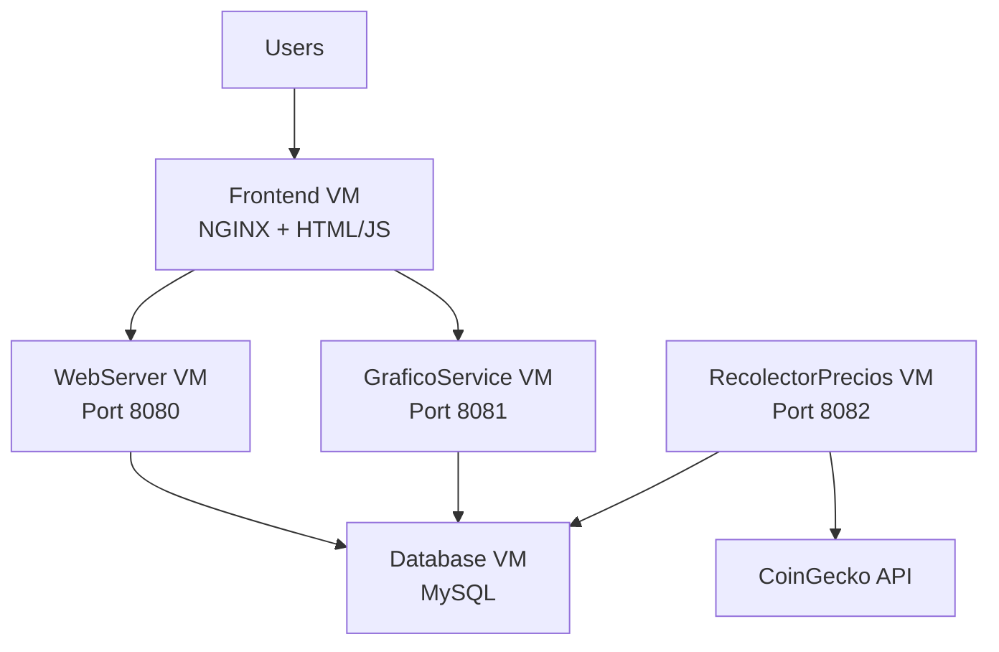

## Overview

CryptoTracker Web is deployed as a distributed system on Google Cloud Platform using Compute Engine VM instances. Each microservice runs on its own dedicated VM for scalability and isolation.

## Architecture

The GCP deployment consists of four main components:



### VM Instances

| VM Name | Purpose | Services | Internal IP | Ports |
|---------|---------|----------|-------------|-------|
| **frontend-vm** | Web interface | NGINX, index.html | - | 80, 443 |
| **webserver-vm** | Price API | WebServer.java | - | 8080 |
| **grafico-vm** | Chart generation | GraficoService.java | - | 8081 |
| **recolector-vm** | Data collection | RecolectorPrecios.java | - | 8082 |
| **database-vm** | Data storage | MySQL | 10.23.176.2 | 3306 |

<Note>
  The database VM uses a static internal IP (10.23.176.2) so that other services can reliably connect to it.
</Note>

## Database VM Setup

<Steps>
  <Step title="Create Database VM">
    Create a Compute Engine instance for the database:
    
    ```bash
    gcloud compute instances create database-vm \
      --zone=us-central1-a \
      --machine-type=e2-medium \
      --image-family=debian-11 \
      --image-project=debian-cloud \
      --boot-disk-size=20GB \
      --network-interface=network=default,network-tier=PREMIUM
    ```
  </Step>

  <Step title="Assign Static Internal IP">
    Assign the internal IP address 10.23.176.2 to the database VM:
    
    ```bash
    gcloud compute instances network-interfaces update database-vm \
      --zone=us-central1-a \
      --network-interface=nic0 \
      --addresses=10.23.176.2
    ```
  </Step>

  <Step title="Install MySQL">
    SSH into the VM and install MySQL:
    
    ```bash
    gcloud compute ssh database-vm --zone=us-central1-a
    
    # Update system
    sudo apt update
    sudo apt upgrade -y
    
    # Install MySQL
    sudo apt install mysql-server -y
    
    # Secure installation
    sudo mysql_secure_installation
    ```
  </Step>

  <Step title="Configure MySQL">
    Configure MySQL to accept connections from other VMs:
    
    ```bash
    # Edit MySQL configuration
    sudo nano /etc/mysql/mysql.conf.d/mysqld.cnf
    
    # Change bind-address to:
    bind-address = 0.0.0.0
    
    # Restart MySQL
    sudo systemctl restart mysql
    ```
    
    Create the database and set up permissions:
    
    ```sql
    sudo mysql -u root -p
    
    CREATE DATABASE criptomonedas_db;
    CREATE USER 'root'@'%' IDENTIFIED BY 'root';
    GRANT ALL PRIVILEGES ON criptomonedas_db.* TO 'root'@'%';
    FLUSH PRIVILEGES;
    ```
    
    <Warning>
      For production, use a strong password and create a dedicated user instead of using root. The connection string in the code uses `user=root&password=root`.
    </Warning>
  </Step>

  <Step title="Create Database Tables">
    Create tables for each cryptocurrency (see [Local Setup](/deployment/local-setup#database-setup) for full table creation SQL).
  </Step>
</Steps>

## Firewall Configuration

<Steps>
  <Step title="Allow Internal Communication">
    Create firewall rules to allow VMs to communicate:
    
    ```bash
    # Allow MySQL connections from internal network
    gcloud compute firewall-rules create allow-mysql-internal \
      --direction=INGRESS \
      --priority=1000 \
      --network=default \
      --action=ALLOW \
      --rules=tcp:3306 \
      --source-ranges=10.128.0.0/9
    
    # Allow microservice ports from internal network
    gcloud compute firewall-rules create allow-services-internal \
      --direction=INGRESS \
      --priority=1000 \
      --network=default \
      --action=ALLOW \
      --rules=tcp:8080-8082 \
      --source-ranges=10.128.0.0/9
    ```
  </Step>

  <Step title="Allow External HTTP/HTTPS">
    Allow public access to the frontend:
    
    ```bash
    gcloud compute firewall-rules create allow-http-https \
      --direction=INGRESS \
      --priority=1000 \
      --network=default \
      --action=ALLOW \
      --rules=tcp:80,tcp:443 \
      --source-ranges=0.0.0.0/0 \
      --target-tags=http-server,https-server
    ```
  </Step>

  <Step title="Allow External API Access (Optional)">
    If you want to access the APIs directly from outside:
    
    ```bash
    gcloud compute firewall-rules create allow-api-external \
      --direction=INGRESS \
      --priority=1000 \
      --network=default \
      --action=ALLOW \
      --rules=tcp:8080-8081 \
      --source-ranges=0.0.0.0/0
    ```
    
    <Note>
      The current deployment (34.36.237.99) allows external access to ports 8080 and 8081.
    </Note>
  </Step>
</Steps>

## Deploy Backend Services

### WebServer Deployment

<Steps>
  <Step title="Create WebServer VM">
    ```bash
    gcloud compute instances create webserver-vm \
      --zone=us-central1-a \
      --machine-type=e2-small \
      --image-family=debian-11 \
      --image-project=debian-cloud
    ```
  </Step>

  <Step title="Install Java">
    ```bash
    gcloud compute ssh webserver-vm --zone=us-central1-a
    
    sudo apt update
    sudo apt install default-jdk -y
    java -version  # Verify Java 17+ is installed
    ```
  </Step>

  <Step title="Upload Application Files">
    From your local machine:
    
    ```bash
    # Upload Java files and dependencies
    gcloud compute scp --recurse source/java webserver-vm:~ --zone=us-central1-a
    ```
  </Step>

  <Step title="Configure and Compile">
    Ensure WebServer.java uses the GCP database URL:
    
    ```java
    private static final String DB_URL = 
      "jdbc:mysql://10.23.176.2:3306/criptomonedas_db?user=root&password=root&useSSL=true";
    ```
    
    Compile and run:
    
    ```bash
    cd java
    javac -cp ".:lib/*" WebServer.java
    java -cp ".:lib/*" WebServer
    ```
  </Step>

  <Step title="Run as Background Service">
    Create a systemd service to run WebServer automatically:
    
    ```bash
    sudo nano /etc/systemd/system/webserver.service
    ```
    
    Add:
    
    ```ini
    [Unit]
    Description=CryptoTracker WebServer
    After=network.target
    
    [Service]
    Type=simple
    User=your_username
    WorkingDirectory=/home/your_username/java
    ExecStart=/usr/bin/java -cp ".:lib/*" WebServer
    Restart=always
    
    [Install]
    WantedBy=multi-user.target
    ```
    
    Enable and start:
    
    ```bash
    sudo systemctl daemon-reload
    sudo systemctl enable webserver
    sudo systemctl start webserver
    sudo systemctl status webserver
    ```
  </Step>
</Steps>

### GraficoService Deployment

Follow the same steps as WebServer, but:

- Create VM named `grafico-vm`
- Use `GraficoService.java` instead
- Service runs on port 8081
- Create systemd service named `graficoservice.service`

### RecolectorPrecios Deployment

Follow the same steps as WebServer, but:

- Create VM named `recolector-vm`
- Use `RecolectorPrecios.java` instead
- Service runs on port 8082
- Create systemd service named `recolectorprecios.service`

<Note>
  RecolectorPrecios automatically collects prices every 60 seconds from the CoinGecko API and stores them in the database.
</Note>

## Frontend Deployment with NGINX

<Steps>
  <Step title="Create Frontend VM">
    ```bash
    gcloud compute instances create frontend-vm \
      --zone=us-central1-a \
      --machine-type=e2-micro \
      --image-family=debian-11 \
      --image-project=debian-cloud \
      --tags=http-server,https-server
    ```
  </Step>

  <Step title="Install NGINX">
    ```bash
    gcloud compute ssh frontend-vm --zone=us-central1-a
    
    sudo apt update
    sudo apt install nginx -y
    sudo systemctl start nginx
    sudo systemctl enable nginx
    ```
  </Step>

  <Step title="Configure Frontend Files">
    Update index.html to use the public IP addresses of your VMs:
    
    ```javascript
    // In index.html, update the API URLs:
    const API_BASE_URL = "http://YOUR_WEBSERVER_PUBLIC_IP";
    const CHART_API_BASE_URL = "http://YOUR_GRAFICO_PUBLIC_IP";
    
    // Or use the frontend VM's IP with reverse proxy (recommended)
    const API_BASE_URL = "http://34.36.237.99";
    const CHART_API_BASE_URL = "http://34.36.237.99";
    ```
  </Step>

  <Step title="Upload Frontend">
    From your local machine:
    
    ```bash
    gcloud compute scp source/frontend/index.html frontend-vm:/tmp/ --zone=us-central1-a
    ```
    
    Then on the frontend VM:
    
    ```bash
    sudo cp /tmp/index.html /var/www/html/
    sudo chown www-data:www-data /var/www/html/index.html
    ```
  </Step>

  <Step title="Configure NGINX Reverse Proxy (Optional)">
    To proxy API requests through the frontend VM:
    
    ```bash
    sudo nano /etc/nginx/sites-available/default
    ```
    
    Add proxy locations:
    
    ```nginx
    server {
        listen 80 default_server;
        root /var/www/html;
        index index.html;
        
        location / {
            try_files $uri $uri/ =404;
        }
        
        location /precios {
            proxy_pass http://WEBSERVER_INTERNAL_IP:8080/precios;
            proxy_set_header Host $host;
            add_header Access-Control-Allow-Origin *;
        }
        
        location /status {
            proxy_pass http://WEBSERVER_INTERNAL_IP:8080/status;
        }
        
        location /grafico {
            proxy_pass http://GRAFICO_INTERNAL_IP:8081/grafico;
            add_header Access-Control-Allow-Origin *;
        }
        
        location /graficoCompara {
            proxy_pass http://GRAFICO_INTERNAL_IP:8081/graficoCompara;
            add_header Access-Control-Allow-Origin *;
        }
        
        location /graficos-todas {
            proxy_pass http://GRAFICO_INTERNAL_IP:8081/graficos-todas;
            add_header Access-Control-Allow-Origin *;
        }
        
        location /regresion {
            proxy_pass http://GRAFICO_INTERNAL_IP:8081/regresion;
            add_header Access-Control-Allow-Origin *;
        }
    }
    ```
    
    Test and reload:
    
    ```bash
    sudo nginx -t
    sudo systemctl reload nginx
    ```
  </Step>
</Steps>

## Using Cloud Storage for Frontend

Alternatively, you can host the frontend on Cloud Storage:

```bash
# Create bucket
gsutil mb gs://frontend-bucket

# Upload frontend
gsutil cp source/frontend/index.html gs://frontend-bucket/

# Make publicly accessible
gsutil iam ch allUsers:objectViewer gs://frontend-bucket

# Access via:
# https://storage.googleapis.com/frontend-bucket/index.html
```

<Note>
  The project includes a reference to uploading from Cloud Storage: `gsutil cp gs://fontend-bucket/index.html /home/master117mm` (source/java/WebServer.java:19)
</Note>

## Verify Deployment

Once all VMs are running:

1. **Test individual services**:
   ```bash
   curl http://WEBSERVER_IP:8080/status
   curl http://GRAFICO_IP:8081/status
   curl http://RECOLECTOR_IP:8082/status
   ```

2. **Test API endpoints**:
   ```bash
   curl http://WEBSERVER_IP:8080/precios
   curl "http://GRAFICO_IP:8081/grafico?crypto=bitcoin&horas=3"
   ```

3. **Access frontend**: Navigate to `http://FRONTEND_IP/` in your browser

4. **Monitor logs**:
   ```bash
   sudo journalctl -u webserver -f
   sudo journalctl -u graficoservice -f
   sudo journalctl -u recolectorprecios -f
   ```

## Production Considerations

<CardGroup cols={2}>
  <Card title="Security" icon="shield">
    - Use SSL/TLS certificates
    - Implement authentication
    - Use strong database passwords
    - Restrict firewall rules
    - Use VPC for internal communication
  </Card>
  
  <Card title="Scaling" icon="arrow-up-right-dots">
    - Use managed instance groups
    - Implement load balancing
    - Use Cloud SQL instead of VM MySQL
    - Enable auto-scaling
    - Use Cloud CDN for frontend
  </Card>
  
  <Card title="Monitoring" icon="chart-line">
    - Set up Cloud Monitoring
    - Configure alerting policies
    - Monitor resource usage
    - Track API response times
    - Set up log aggregation
  </Card>
  
  <Card title="Backup" icon="database">
    - Schedule database backups
    - Use Cloud SQL automated backups
    - Take VM snapshots
    - Version control configuration
    - Document disaster recovery
  </Card>
</CardGroup>

## Cost Optimization

- Use **e2-micro** or **e2-small** instances for low-traffic services
- Use **preemptible VMs** for development environments
- Consider **Cloud Run** for containerized microservices
- Use **Cloud SQL** with automatic scaling
- Implement **caching** to reduce database queries

## Next Steps

- Configure [service settings](/deployment/configuration)
- Set up [monitoring and alerts](https://cloud.google.com/monitoring)
- Implement [SSL certificates](https://cloud.google.com/load-balancing/docs/ssl-certificates)
- Review [API endpoints](/api/overview)